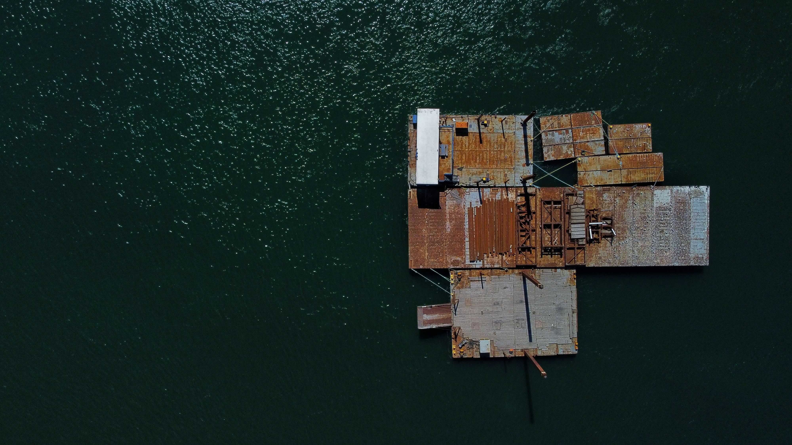
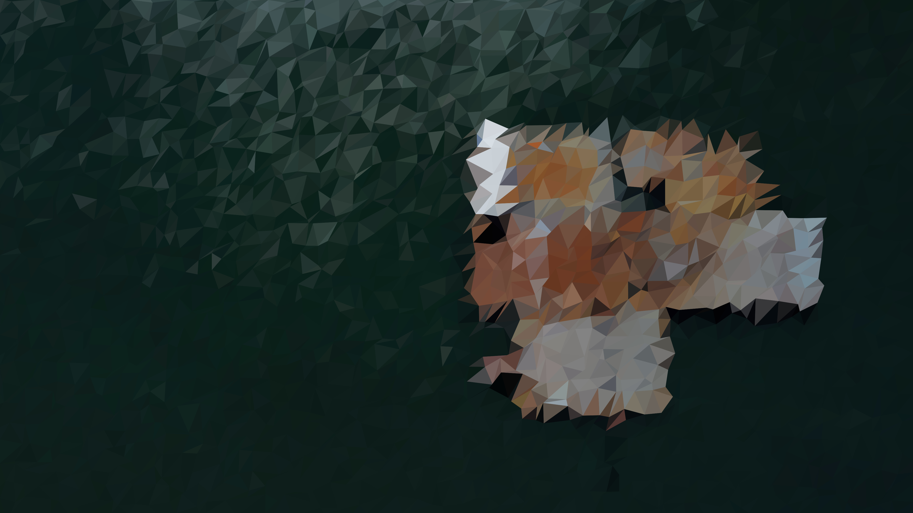
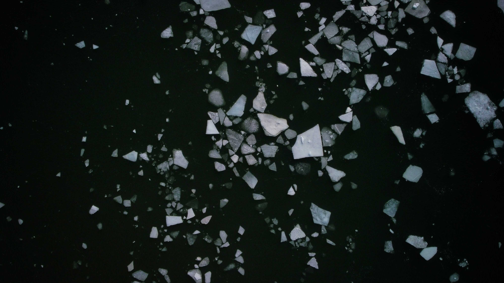
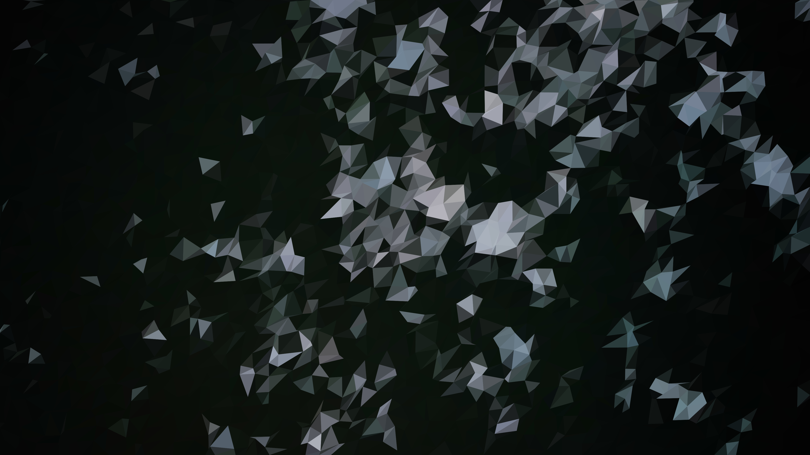

# img2lp
### img2lp is a simple CLI tool that generates low-poly artworks from images

## Usage
```
Options:
      --help           Show help                                       [boolean]
      --version        Show version number                             [boolean]
  -d, --pointsDensity  Points density in percent         [number] [default: 1.5]
  -r, --colourRadius   Radius used to calculate average vertex colour in pixels
                                                          [number] [default: 30]
  -i, --inputPath      Input file path                       [string] [required]
  -o, --outputPath     Output file path                      [string] [required]
  -f, --outputFormat   Output file format              [string] [default: "png"]
```

## Examples (using default options)
### Example 1
**Input**


**Output**

### Example 2
**Input**


**Output**


